<div align="center">



[](https://www.linkedin.com/in/ishaan-chandak-558b0822b/)
[](mailto:ishaanchandak3@gmail.com)
[](./Resume.pdf)

</div>

## `> PLAYER_PROFILE`

```yaml
name: Ishaan Vinay Chandak
class: Software Engineer
guild: Goldman Sachs
base: Mumbai, India
education: B.Tech in Information Technology @ VJTI · 9.00/10
main_quest: Build scalable systems and advance into AI/ML + quantitative development
play_style: End-to-end ownership · practical engineering · measurable impact
```

## `> CURRENT_QUEST` 🟢

<!-- CURRENT-QUEST: Edit the three lines below whenever your focus changes. -->

> **Building:** enterprise workflow automation and hybrid AWS data pipelines  
> **Learning:** advanced algorithm design, data modeling, and ML architectures  
> **Next checkpoint:** reliable, secure systems that turn complex workflows into simple experiences

## `> CAMPAIGN_LOG`

<table>
<tr>
<td width="50%" valign="top">

### ⚙️ Enterprise Systems Arc

**Analyst · Goldman Sachs** `2025 → NOW`

- Building scalable Java/Quarkus microservices
- Orchestrating 15+ datasets through AWS
- Applying Presidio, IAM, and KMS for zero-PII pipelines
- Solving production issues across four teams

</td>
<td width="50%" valign="top">

### 🏹 Automation Speedrun

**Summer Analyst · Goldman Sachs** `2024`

- Shipped a production reporting pipeline in Go
- Eliminated **100%** of weekly manual reporting
- Cut operational overhead by **40%**
- Added CI/CD, logging, testing, and fault tolerance

</td>
</tr>
</table>

## `> BOSS_BATTLES`

<table>
<tr>
<td width="50%" valign="top">

### 🥭 Mango Attribute Detection

**Boss:** perspective ambiguity in agricultural quality assessment  
**Party role:** Team Lead  
**Loadout:** Faster R-CNN · ResNet-50 FPN · MiDaS · PyTorch · XGBoost

Designed the end-to-end multi-task vision pipeline and fused depth with geometric features from **972 annotated instances**.

**Reward unlocked:** `+13.37% classification accuracy`

[Enter repository →](https://github.com/Dishie2498/Multitask-Learning-of-Fruit-Attributes)

</td>
<td width="50%" valign="top">

### 🧬 DermAI

**Boss:** noisy, limited clinical image data  
**Party role:** ML Engineer  
**Loadout:** CNNs · OpenCV · PyTorch · TensorFlow/Keras

Built preprocessing, augmentation, and evaluation workflows for preliminary dermatological disease classification.

**Reward unlocked:** `real-world medical CV experience`

[Enter repository →](https://github.com/Ruchapatil03/DermAI)

</td>
</tr>
</table>

## `> INVENTORY`

**Languages**  


**AI / data**  


**Systems / cloud**  


## `> ACHIEVEMENTS_UNLOCKED`

- 🏆 **AIR 9** — Codex Competitive Programming Contest, IIIT Sri City
- ⚡ **99.83 percentile / State Rank 100** — MHT-CET among 400,000+ candidates
- 🎪 **20,000-player event** — Execution Head for Pratibimb, coordinating 30+ events
- 🧭 **800+ learners reached** — workshops and bootcamps with Community of Coders, VJTI
- 🤝 **10+ juniors mentored** — data structures, algorithms, and problem solving

## `> PLAYER_STATS`

<div align="center">


<sub>Open to conversations about software engineering, AI/ML, and systems that remove repetitive work.</sub>

</div>

